# 一、Mybatis-Plus 简介

## 1、简介

**Mybatis-Plus**（简称 MP） 是一个 **Mybatis的增强工具**，在 Mybatis 的基础上**只做增强，不做改变**，为**简化开发，提高效率而生**


## 2、特性

- **无侵入**：只做增强不做改变，引入它不会对现有工程产生影响，如丝般顺滑
- **损耗小**：启动即会自动注入基本 CURD，性能基本无损耗，直接面向对象操作
- **强大的 CRUD 操作**：内置通用 Mapper、通用 Service，仅仅通过少量配置即可实现单表大部分 CRUD 操作，更有强大的条件构造器，满足各类使用需求
- **支持 Lambda 形式调用**：通过 Lambda 表达式，方便的编写各类查询条件，无需再担心字段写错
- **支持主键自动生成**：支持多达 4 种主键策略（内含分布式唯一 ID 生成器 - Sequence），可自由配置，完美解决主键问题
- **支持 ActiveRecord 模式**：支持 ActiveRecord 形式调用，实体类只需继承 Model 类即可进行强大的 CRUD 操作
- **支持自定义全局通用操作**：支持全局通用方法注入（ Write once, use anywhere ）
- **内置代码生成器**：采用代码或者 Maven 插件可快速生成 Mapper 、 Model 、 Service 、 Controller 层代码，支持模板引擎，更有超多自定义配置等您来使用
- **内置分页插件**：基于 MyBatis 物理分页，开发者无需关心具体操作，配置好插件之后，写分页等同于普通 List 查询
- **分页插件支持多种数据库**：支持 MySQL、MariaDB、Oracle、DB2、H2、HSQL、SQLite、Postgre、SQLServer 等多种数据库
- **内置性能分析插件**：可输出 SQL 语句以及其执行时间，建议开发测试时启用该功能，能快速揪出慢查询
- **内置全局拦截插件**：提供全表 delete 、 update 操作智能分析阻断，也可自定义拦截规则，预防误操作


## 3、支持数据库


## 4、框架结构

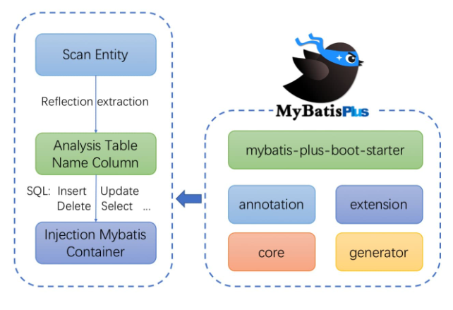


## 5、代码及文档地址

官方地址: http://mp.baomidou.com 

Github: https://github.com/baomidou/mybatis-plus 

Gitee: https://gitee.com/baomidou/mybatis-plus 

文档发布地址: https://baomidou.com/pages/24112f


# 二、入门案例

## 1、开发环境 

IDE：idea 2023

JDK：JDK8+ 构建工具：maven 3.5.4 

MySQL版本：MySQL 8.30

Spring Boot：3.1.0

MyBatis-Plus：3.5.3.1


## 2、创建数据库及表

### 创建表

```sql
create database mybatis_plus char set = utf8; /* 创建库 */
use mybatis_plus;
create table user( /* 创建表 */
	id bigint(20) not null primary key comment '主键ID',
	name varchar(30) default null comment '姓名',
	age int(11) default null comment '年龄',
	email varchar(50) default null comment '邮箱'
)	
```


### 添加数据

```sql
insert into user(id, name, age, email) values
(1, 'Jone', 18, 'test1@baomidou.com'),
(2, 'Jack', 20, 'test2@baomidou.com'),
(3, 'Tom', 28, 'test3@baomidou.com'),
(4, 'Sandy', 21, 'test4@baomidou.com'),
(5, 'Billie', 24, 'test5@baomidou.com');
```


## 3、创建 Spring Boot 工程

导入依赖

```xml
    <packaging>jar</packaging>

    <properties>
        <maven.compiler.source>8</maven.compiler.source>
        <maven.compiler.target>8</maven.compiler.target>
        <project.build.sourceEncoding>UTF-8</project.build.sourceEncoding>
    </properties>

    <dependencies>
        <!--    springboot web 依赖    -->
        <dependency>
            <groupId>org.springframework.boot</groupId>
            <artifactId>spring-boot-starter-web</artifactId>
            <version>3.1.0</version>
        </dependency>

        <!--    mysql 8.0 依赖    -->
        <dependency>
            <groupId>mysql</groupId>
            <artifactId>mysql-connector-java</artifactId>
            <version>8.0.30</version>
        </dependency>

        <!--    mybatis-plus 启动器依赖    -->
        <dependency>
            <groupId>com.baomidou</groupId>
            <artifactId>mybatis-plus-boot-starter</artifactId>
            <version>3.5.3.1</version>
        </dependency>

        <!--    lombok 实体类徐华开发依赖    -->
        <dependency>
            <groupId>org.projectlombok</groupId>
            <artifactId>lombok</artifactId>
            <optional>true</optional>
        </dependency>
    </dependencies>

    <!--    maven 打包插件    -->
    <build>
        <plugins>
            <plugin>
                <groupId>org.springframework.boot</groupId>
                <artifactId>spring-boot-maven-plugin</artifactId>
                <version>3.1.0</version>
            </plugin>
        </plugins>
    </build>
```


### 注意：

>1、驱动类 driver-class-name
>
>​	Spring boot 2 （内置 jdbc5 驱动），驱动类使用：
>
>driver-class-name: com.mysql.jdbc.Driver 
>
>spring boot 2.1及以上（内置jdbc8驱动），驱动类使用：driver-class-name: com.mysql.cj.jdbc.Driver 
>
>否则运行测试用例的时候会有 WARN 信息 
>
>
>
>2、连接地址url MySQL5.7版本的url：
>
>jdbc:mysql://localhost:3306/mybatis_plus?characterEncoding=utf-8&useSSL=false 
>
>MySQL8.0版本的url： 
>
>jdbc:mysql://localhost:3306/mybatis_plus?serverTimezone=GMT%2B8&characterEncoding=utf-8&useSSL=false 
>
>否则运行测试用例报告如下错误： 
>
>java.sql.SQLException: The server time zone value 'Öйú±ê׼ʱ¼ä' is unrecognized or represents more


###  启动类

>在 Spring Boot 启动类中添加 @MapperScan 注解，扫描 mapper 包

```java
@SpringBootApplication
// 扫描指定包下的 mapper 接口
@MapperScan("com.Ri.mybatis_plus.mapper")
public class MybatisPlusApplication {
    public static void main(String[] args) {
        SpringApplication.run(MybatisPlusApplication.class, args);
    }
}
```


### 添加实体

```java
@Data // lombok 注解
@AllArgsConstructor // 全参构造器
@NoArgsConstructor // 无参构造器
public class User {
    private Long id;
    private String name;
    private Integer age;
    private  String email;
}
```

User 预编译后的结果：

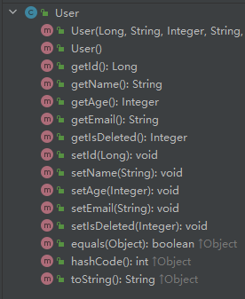


### 添加 Mapper

>BaseMapper 是 MyBatis-Plus 提供的模板 mapper，其中包含了基本的 CRUD 方法，泛型为操作的实体类型

```java
@Mapper
public interface UserMapper extends BaseMapper<User> {
}
```


### 测试

```java
@SpringBootTest
// 如果启动失败则可以看一下该包名是否和 上面 java 的包名一致!!!
public class MybatisPlusTest {

    @Autowired
    private UserMapper userMapper;

    @Test
    public void test_selectList(){
        // 使用父类内的方法, 通过条件构造器查询一个 List 集合, 若没有条件, 则可以设置为 null 参数
        // SELECT id,name,age,email FROM user
        List<User> users = userMapper.selectList(null);
        users.forEach(System.out::println);
    }
}
```


#### **结果：**

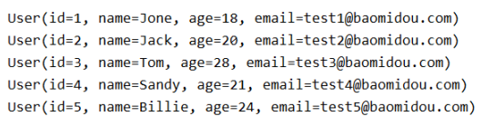


#### 注意：

>IDEA 在 userMapper 处报错，因为找不到注入的对象，因为类是动态创建的，但是程序是可以正确执行。
>
>为了避免报错，可以在 mapper 接口上添加 @Repository 注解 


### 添加日志

在 application.yml 配置文件中配置日志输出，更好的学习 mybatis-plus

```yaml
mybatis-plus:
  configuration:
    # 使用 mybatis-plus 的日志功能, 来查看 mybatis-plus 自动生成的 sql
    log-impl: org.apache.ibatis.logging.stdout.StdOutImpl
```

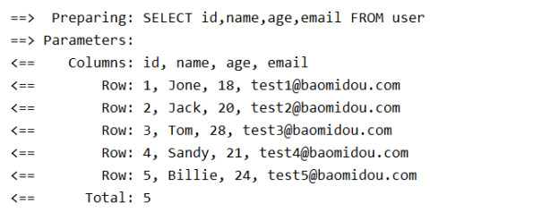


# 三、基本 CRUD

## 1、BashMapper

Mybatis-Plus 中的基本 CRUD 在内置的 BaseMapper 中已得到了实现，我们可以直接使用，接口如下：

```java
/**
 * Mapper 继承该接口后，无需编写 mapper.xml 文件，即可获得CRUD功能
 * <p>这个 Mapper 支持 id 泛型</p>
 *
 * @author hubin
 * @since 2016-01-23
 */
public interface BaseMapper<T> extends Mapper<T> {

    /**
     * 插入一条记录
     *
     * @param entity 实体对象
     */
    int insert(T entity);

    /**
     * 根据 ID 删除
     *
     * @param id 主键ID
     */
    int deleteById(Serializable id);

    /**
     * 根据实体(ID)删除
     *
     * @param entity 实体对象
     * @since 3.4.4
     */
    int deleteById(T entity);

    /**
     * 根据 columnMap 条件，删除记录
     *
     * @param columnMap 表字段 map 对象
     */
    int deleteByMap(@Param(Constants.COLUMN_MAP) Map<String, Object> columnMap);

    /**
     * 根据 entity 条件，删除记录
     *
     * @param queryWrapper 实体对象封装操作类（可以为 null,里面的 entity 用于生成 where 语句）
     */
    int delete(@Param(Constants.WRAPPER) Wrapper<T> queryWrapper);

    /**
     * 删除（根据ID或实体 批量删除）
     *
     * @param idList 主键ID列表或实体列表(不能为 null 以及 empty)
     */
    int deleteBatchIds(@Param(Constants.COLL) Collection<?> idList);

    /**
     * 根据 ID 修改
     *
     * @param entity 实体对象
     */
    int updateById(@Param(Constants.ENTITY) T entity);

    /**
     * 根据 whereEntity 条件，更新记录
     *
     * @param entity        实体对象 (set 条件值,可以为 null)
     * @param updateWrapper 实体对象封装操作类（可以为 null,里面的 entity 用于生成 where 语句）
     */
    int update(@Param(Constants.ENTITY) T entity, @Param(Constants.WRAPPER) Wrapper<T> updateWrapper);

    /**
     * 根据 ID 查询
     *
     * @param id 主键ID
     */
    T selectById(Serializable id);

    /**
     * 查询（根据ID 批量查询）
     *
     * @param idList 主键ID列表(不能为 null 以及 empty)
     */
    List<T> selectBatchIds(@Param(Constants.COLL) Collection<? extends Serializable> idList);

    /**
     * 查询（根据 columnMap 条件）
     *
     * @param columnMap 表字段 map 对象
     */
    List<T> selectByMap(@Param(Constants.COLUMN_MAP) Map<String, Object> columnMap);

    /**
     * 根据 entity 条件，查询一条记录
     * <p>查询一条记录，例如 qw.last("limit 1") 限制取一条记录, 注意：多条数据会报异常</p>
     *
     * @param queryWrapper 实体对象封装操作类（可以为 null）
     */
    default T selectOne(@Param(Constants.WRAPPER) Wrapper<T> queryWrapper) {
        List<T> list = this.selectList(queryWrapper);
        // 抄自 DefaultSqlSession#selectOne
        if (list.size() == 1) {
            return list.get(0);
        } else if (list.size() > 1) {
            throw new TooManyResultsException("Expected one result (or null) to be returned by selectOne(), but found: " + list.size());
        } else {
            return null;
        }
    }

    /**
     * 根据 Wrapper 条件，判断是否存在记录
     *
     * @param queryWrapper 实体对象封装操作类
     * @return 是否存在记录
     */
    default boolean exists(Wrapper<T> queryWrapper) {
        Long count = this.selectCount(queryWrapper);
        return null != count && count > 0;
    }

    /**
     * 根据 Wrapper 条件，查询总记录数
     *
     * @param queryWrapper 实体对象封装操作类（可以为 null）
     */
    Long selectCount(@Param(Constants.WRAPPER) Wrapper<T> queryWrapper);

    /**
     * 根据 entity 条件，查询全部记录
     *
     * @param queryWrapper 实体对象封装操作类（可以为 null）
     */
    List<T> selectList(@Param(Constants.WRAPPER) Wrapper<T> queryWrapper);

    /**
     * 根据 Wrapper 条件，查询全部记录
     *
     * @param queryWrapper 实体对象封装操作类（可以为 null）
     */
    List<Map<String, Object>> selectMaps(@Param(Constants.WRAPPER) Wrapper<T> queryWrapper);

    /**
     * 根据 Wrapper 条件，查询全部记录
     * <p>注意： 只返回第一个字段的值</p>
     *
     * @param queryWrapper 实体对象封装操作类（可以为 null）
     */
    List<Object> selectObjs(@Param(Constants.WRAPPER) Wrapper<T> queryWrapper);

    /**
     * 根据 entity 条件，查询全部记录（并翻页）
     *
     * @param page         分页查询条件（可以为 RowBounds.DEFAULT）
     * @param queryWrapper 实体对象封装操作类（可以为 null）
     */
    <P extends IPage<T>> P selectPage(P page, @Param(Constants.WRAPPER) Wrapper<T> queryWrapper);

    /**
     * 根据 Wrapper 条件，查询全部记录（并翻页）
     *
     * @param page         分页查询条件
     * @param queryWrapper 实体对象封装操作类
     */
    <P extends IPage<Map<String, Object>>> P selectMapsPage(P page, @Param(Constants.WRAPPER) Wrapper<T> queryWrapper);
}

```


## 2、插入

```java
    @Test
    public void test_insert(){
        // 新增用户信息
        // INSERT INTO user ( id, name, age, email ) VALUES ( ?, ?, ?, ? )
        User user = new User();
        user.setName("Ri");
        user.setAge(20);
        user.setEmail("rrrrrrri@qq.com");
        int result = userMapper.insert(user);
        System.out.println("result：" + result);
        System.out.println("id:" + user.getId());
    }
```


## 3、 删除

### a> 通过 id 删除记录

```java
    @Test
    public void test_deleteById(){
        // 通过 id  删除用户信息
        // DELETE FROM user WHERE id=?
        int result = userMapper.deleteById(1814296898402951169L);
        System.out.println("result=" + result);
    }
```


### b> 通过 id 批量删除记录

```java
    @Test
    public void test_deleteBatchIds(){
        // 批量根据 id 删除数据
        // DELETE FROM user WHERE id IN ( ? , ? , ? )
        List<Long> list = Arrays.asList(1L, 2L, 3L);
        int result = userMapper.deleteBatchIds(list);
        System.out.println("result=" + result);
    }
```


### c> 通过 map 条件删除记录

```java
    @Test
    public void test_deleteByMap(){
        // 根据 map 来进行条件删除, map 里面存放的是被删除的条件值
        // DELETE FROM user WHERE name = ? AND age = ?
        Map<String, Object> map = new HashMap<>();
        map.put("name", "张三");
        map.put("age", 19);

        int result = userMapper.deleteByMap(map);
        System.out.println("result=" + result);
    }

```


## 4、修改

```java
    @Test
    public void test_updateById(){
        // 根据 id 来修改数据
        // UPDATE user SET name=?, age=?, email=? WHERE id=?
        User user = new User(4L, "李四", 19,  "lisi@ri.com", 0);
        int result = userMapper.updateById(user);
        System.out.println("result=" + result);
    }
```


## 5、查询

### a> 根据 id 查询用户信息

```java
    @Test
    public void test_selectById(){
        // 根据 id 来查询用户信息
        // SELECT id,name,age,email FROM user WHERE id=?
        User user = userMapper.selectById(1L);
        System.out.println("user=" + user);
    }
```


### b> 根据多个 id 查询多个用户信息

```java
    @Test
    public void test_selectBatchIds(){
        // 根据 id 批量查询用户信息
        // SELECT id,name,age,email FROM user WHERE id IN ( ? , ? , ? )
        List<Long> lists = Arrays.asList(1L, 2L, 3L);
        List<User> users = userMapper.selectBatchIds(lists);
        users.forEach(System.out::println);
    }
```


### c> 通过 map 条件查询用户信息

```java
    @Test
    public void test_selectByMap(){
        // 根据给定 Map 集合的条件进行查询
        // SELECT id,name,age,email FROM user WHERE name = ? AND age = ?
        Map<String, Object> map = new HashMap<>();
        map.put("name", "Jack");
        map.put("age", 20);

        List<User> users = userMapper.selectByMap(map);
        users.forEach(System.out::println);
    }
```


### d> 查询所有数据

```java
    @Test
    public void test_selectList(){
        // 使用父类内的方法, 通过条件构造器查询一个 List 集合, 若没有条件, 则可以设置为 null 参数
        // SELECT id,name,age,email FROM user
        List<User> users = userMapper.selectList(null);
        users.forEach(System.out::println);
    }
```


## 6、通用 Service

>说明：
>
>- 通用 Service CRUD 封装 Service 接口，进一步封装 CRUD 采用 
>
>  - **`get 查询单行`**
>  -  **`remove 删除`** 
>  - **`list 查询集合`**
>  - **`page 分页`**
>
>  前缀命名方式区分 `Mapper` 层避免混淆
>
>- 泛型 **`T`** 为任意实体对象
>
>- 建议如果存在自定义通用 Service 方法可能，请创建自己的 `IBaseMapper` 继承 `Mybatis-Plus` 提供的基类
>
>- 官网地址：[持久层接口 | MyBatis-Plus (baomidou.com)](https://baomidou.com/guides/data-interface/#service-interface)


### a> IService

Mybatis-Plus 中有一个接口 IService 和其实现类 ServiceImpl，封装了常见的业务层逻辑详情查看源码 IService 和 ServiceImpl


### b> 创建 Service 接口和实现类

```java
/**
 * userService 继承 IService 模板提供的基础功能
 */
public interface UserService extends IService<User> {
}
```


```java
// ServiceImpl 泛型内的 M 参数是 我们要操作的接口, T 是操作的类型
@Service
public class UserServiceImpl extends ServiceImpl<UserMapper, User> implements UserService {

}
```


### c> 测试查询记录数

```java
    @Test
    public void test_count() {
        // 查询总记录数
        // SELECT COUNT( * ) AS total FROM user
        long count = userService.count();
        System.out.println("总记录数：" + count);
    }
```


### d> 测试批量插入

```java
    @Test
    public void test_insertMore(){
        // 批量添加多条数据
        // Preparing: INSERT INTO user ( id, name, age ) VALUES ( ?, ?, ? )
        List<User> lists = new ArrayList<>();
        for (int i = 1; i <= 10; ++i){
            User user = new User();
            user.setName("Ri" + i);
            user.setAge(20 + i);
            lists.add(user);
        }
        boolean b = userService.saveBatch(lists);
        System.out.println("是否操作成功：" + b);
    }
```


# 四、常用注解

## 1、@TableName

>经过以上的测试，在使用 MyBatis-Plus 实现基本的 CRUD 时，我们并没有指定要操作的表，只是在 Mapper 接口继承 BaseMapper 时，设置了泛型 User，而操作的表为  user 表
>
>由此得出结论，MyBatis-Plus 在确定操作的表时，由 **BaseMapper 的泛型决定**，即实体类型决定，且默认操作的表名和实体类型的类名一致


### a> 问题

>若实体类类型的类名和要操作的表的表名不一致，会出现什么问题？
>
>我们将表 **user** 更名为 **t_user**，测试查询功能
>
>程序抛出异常，Table 'mybatis_plus.user' doesn't exist，因为现在的表名为 **t_user**，而默认操作的表名和实体类型的类名一致，即 user 表

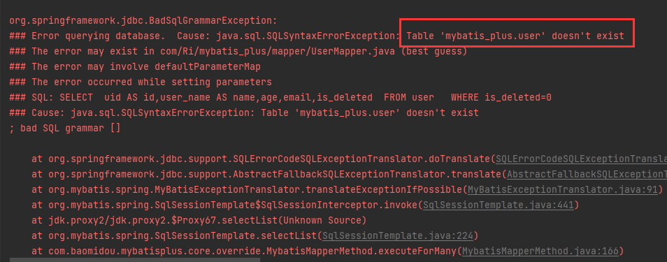


### b> 通过 @TableName 解决问题

>在实体类上添加 **@TableName("t_user")**，标识实体类对应的表，即可成功执行 SQL 语句

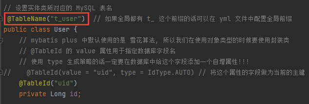


### c> 通过全局配置解决问题

>在开发的过程中，我们经常遇到以上的问题，即实体类所对应的表都有固定的前缀，例如：**_t** 或 **tbl_**
>
>此时，可以使用 MyBatis-Plus 提供的全局配置，为实体类所对应的表名设置默认的前缀，那么就不需要在每个实体类上通过 **@TableName** 注解来标识实体类所对应的表

```yaml
mybatis-plus:
  configuration:
    # 使用 mybatis-plus 的日志功能, 来查看 mybatis-plus 自动生成的 sql
    log-impl: org.apache.ibatis.logging.stdout.StdOutImpl

  # mybatis-plus 的默认路径是类路径下mapper下的所有xml文件, 如果不写也是一样的
  mapper-locations: "classpath*:/mapper/**/*.xml"

  # 设置 mybatis plus 的全局配置
  global-config:
    db-config:
      # 设置 实体类 对流的表的统一前缀
      table-prefix: t_
```


## 2、@TableId

>经过以上的测试，MyBats-Plus 在实现 CRUD 时，会默认将 id 作为主键列，并在插入数据时，默认基于雪花算法的策略生成 id


### a> 问题

>若实体类和表中表示主键的不是 id，而是其它字段，例如：uid，MyBatis-Plus 会自动识别 uid 为主键列吗？
>
>我们实体类中的属性 id 改为 uid，将表中的字段 id 也改为 uid，测试添加功能
>
>程序抛出异常，FIeld 'uid' doesn't have a default value，说明 MyBatis-Plus 没有将 uid 作为主键赋值

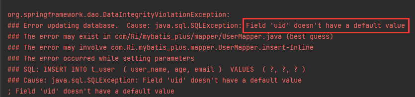


### b> 通过 @TableId 解决问题

>在实体类中 uid 属性上通过 @TableId 将其标识为主键，即可成功执行 SQL 语句

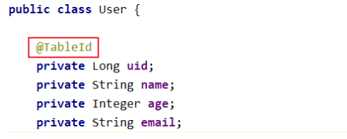


### c> @TableId 的 value 属性

>若实体类中主键对应的属性为 id，而表中表示主键的字段为 uid，此时若只在属性 id 上添加注解 @TableId，则抛出异常 Unknow column 'id' in 'field list'，即 MyBatis-Plus 仍然会将 id 作为表的主键操作，而表中表示主键的字段是 uid
>
>此时需要通过 @TableId 注解的 value 属性，指定表中的主键字段，**@TableId("uid")** 或 **@TableId(value = "uid")**

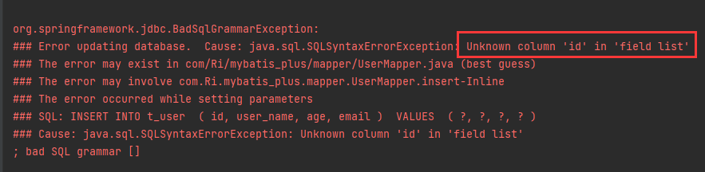


### d> @TableId 的 type 属性

>type 属性用来定义主键策略


#### 常用的主键策略：

|            值            |                             描述                             |
| :----------------------: | :----------------------------------------------------------: |
| IdType_ASSIGN_ID（默认） | 基于雪花算法的策略生成数据 id，与数据库 id 是否设置自增无关  |
|       IdType_AUTO        | 使用数据库的自增策略，注意：该类型请确保数据库设置了 id 自增，否则无效 |


#### 配置全局主键策略：

```yaml
mybatis-plus:
  configuration:
    # 使用 mybatis-plus 的日志功能, 来查看 mybatis-plus 自动生成的 sql
    log-impl: org.apache.ibatis.logging.stdout.StdOutImpl

  # mybatis-plus 的默认路径是类路径下mapper下的所有xml文件, 如果不写也是一样的
  mapper-locations: "classpath*:/mapper/**/*.xml"

  # 设置 mybatis plus 的全局配置
  global-config:
    db-config:
      # 设置 实体类 对流的表的统一前缀
      table-prefix: t_
      # 设置统一的主键生成策略
      id-type: auto
```


### e> 雪花算法

- <font style="font-size:20px">**背景**</font>

需要选择合适的方案去应对数据规模的增长，以应对逐渐增长的访问压力和数据量。 数据库的扩展方式主要包括：业务分库、主从复制，数据库分表。

- <font style="font-size:20px">**数据库分表**</font>

将不同业务数据分散存储到不同的数据库服务器，能够支撑百万甚至千万用户规模的业务，但如果业务 继续发展，同一业务的单表数据也会达到单台数据库服务器的处理瓶颈。例如，淘宝的几亿用户数据， 如果全部存放在一台数据库服务器的一张表中，肯定是无法满足性能要求的，此时就需要对单表数据进 行拆分。 

单表数据拆分有两种方式：垂直分表和水平分表。示意图如下：

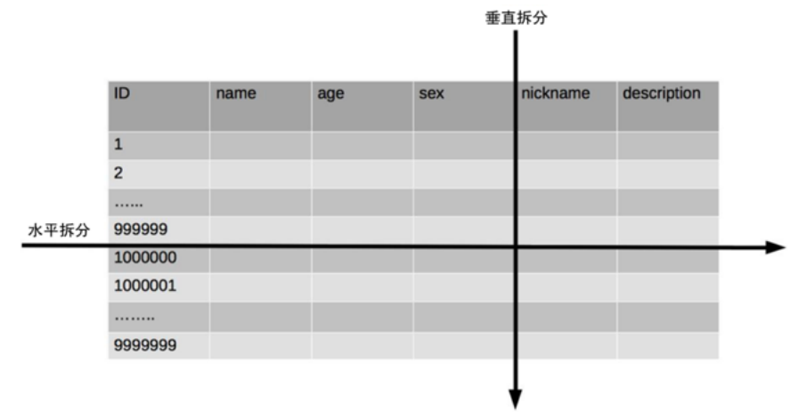


- <font style="font-size:20px">**垂直分表**</font>

垂直分表适合将表中某些不常用且占了大量空间的列拆分出去。 

例如，前面示意图中的 nickname 和 description 字段，假设我们是一个婚恋网站，用户在筛选其他用 户的时候，主要是用 age 和 sex 两个字段进行查询，而 nickname 和 description 两个字段主要用于展 示，一般不会在业务查询中用到。description 本身又比较长，因此我们可以将这两个字段独立到另外 一张表中，这样在查询 age 和 sex 时，就能带来一定的性能提升。


- <font style="font-size:20px">**水平分表**</font>

水平分表适合表行数特别大的表，有的公司要求单表行数超过 5000 万就必须进行分表，这个数字可以 作为参考，但并不是绝对标准，关键还是要看表的访问性能。对于一些比较复杂的表，可能超过 1000 万就要分表了；而对于一些简单的表，即使存储数据超过 1 亿行，也可以不分表。

但不管怎样，当看到表的数据量达到千万级别时，作为架构师就要警觉起来，因为这很可能是架构的性 能瓶颈或者隐患。

水平分表相比垂直分表，会引入更多的复杂性，例如要求全局唯一的数据id该如何处理


<font style="font-size:18px">**主键自增**</font>

①以最常见的用户 ID 为例，可以按照 1000000 的范围大小进行分段，1 ~ 999999 放到表 1中， 1000000 ~ 1999999 放到表2中，以此类推。 

②复杂点：分段大小的选取。分段太小会导致切分后子表数量过多，增加维护复杂度；分段太大可能会 导致单表依然存在性能问题，一般建议分段大小在 100 万至 2000 万之间，具体需要根据业务选取合适 的分段大小。 

③优点：可以随着数据的增加平滑地扩充新的表。例如，现在的用户是 100 万，如果增加到 1000 万， 只需要增加新的表就可以了，原有的数据不需要动。 

④缺点：分布不均匀。假如按照 1000 万来进行分表，有可能某个分段实际存储的数据量只有 1 条，而 另外一个分段实际存储的数据量有 1000 万条。


<font style="font-size:18px">**取模**</font>

①同样以用户 ID 为例，假如我们一开始就规划了 10 个数据库表，可以简单地用 user_id % 10 的值来 表示数据所属的数据库表编号，ID 为 985 的用户放到编号为 5 的子表中，ID 为 10086 的用户放到编号 为 6 的子表中。 

②复杂点：初始表数量的确定。表数量太多维护比较麻烦，表数量太少又可能导致单表性能存在问题。 

③优点：表分布比较均匀。 ④缺点：扩充新的表很麻烦，所有数据都要重分布。


<font style="font-size:18px">**雪花算法**</font>

雪花算法是由Twitter公布的分布式主键生成算法，它能够保证不同表的主键的不重复性，以及相同表的 主键的有序性。

 ①核心思想：

 长度共64bit（一个long型）。 

首先是一个符号位，1bit标识，由于long基本类型在Java中是带符号的，最高位是符号位，正数是0，负 数是1，所以id一般是正数，最高位是0。 

41bit时间截(毫秒级)，存储的是时间截的差值（当前时间截 - 开始时间截)，结果约等于69.73年。 

10bit作为机器的ID（5个bit是数据中心，5个bit的机器ID，可以部署在1024个节点）。 

12bit作为毫秒内的流水号（意味着每个节点在每毫秒可以产生 4096 个 ID）。

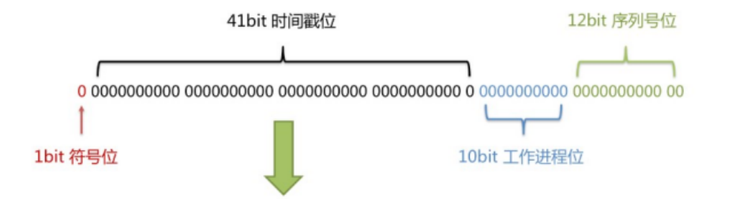

②优点：整体上按照时间自增排序，并且整个分布式系统内不会产生ID碰撞，并且效率较高。


## 3、@TableField

>经过以上的测试，我们可以发现，MyBatis-Plus在执行SQL语句时，要保证实体类中的属性名和 表中的字段名一致 
>
>如果实体类中的属性名和字段名不一致的情况，会出现什么问题呢？


### a> 情况一

>若实体类中的属性使用的是驼峰命名风格，而表中的字段使用的是下划线命名风格 
>
>例如实体类属性userName，表中字段user_name 
>
>此时MyBatis-Plus会自动将下划线命名风格转化为驼峰命名风格 
>
>相当于在MyBatis中配置


### b> 情况二

>若实体类中的属性和表中的字段不满足情况
>
>例如实体类属性name，表中字段username 
>
>此时需要在实体类属性上使用@TableField("username")设置属性所对应的字段名

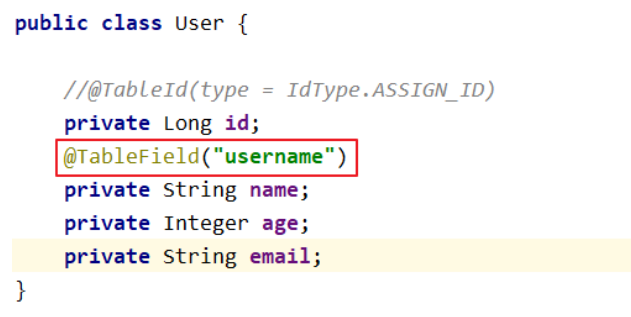


## 4、TableLogic

### a> 逻辑删除

- 物理删除：真实删除，将对应数据从数据库中删除，之后查询不到此条被删除的数据 
- 逻辑删除：假删除，将对应数据中代表是否被删除字段的状态修改为“被删除状态”，之后在数据库 中仍旧能看到此条数据记录 
- 使用场景：可以进行数据恢复


### b> 实现逻辑删除

>step1：数据库中创建逻辑删除状态列，设置默认值为 0

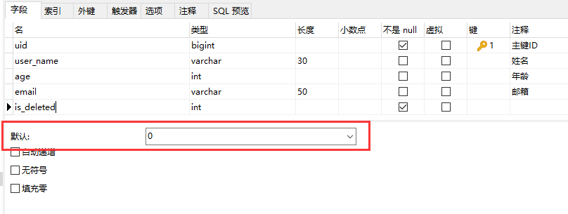


>step2：实体类中添加逻辑删除属性

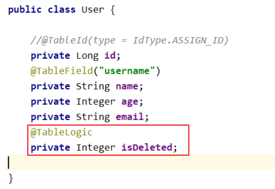


>step3：测试
>
>测试删除功能，真正执行的是修改
>
>`UPDATE t_user SET is_deleted=1 WHERE uid IN ( ? , ? , ? ) AND is_deleted=0`
>
>测试查询功能，被逻辑删除的数据默认不会被查询
>
>`SELECT uid AS id,user_name AS name,age,email,is_deleted FROM t_user WHERE is_deleted=0`


# 五、条件构造器和常用接口

## 1、Wrapper介绍


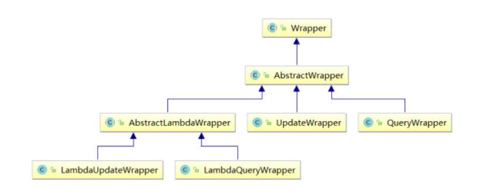

- Wrapper：条件构造抽象类，最顶端父类
  - AbstractWrapper：用于查询条件封装，生成 sql 的 where 条件
    - QueryWrapper：查询条件封装
    - UpdateWrapper：更新条件封装
    - AbstractLambdaWrapper：使用 Lambda 语法
      - LambdaQueryWrapper：用于 Lambda 语法使用的查询 Wrapper
      - LambdaUpdateWrapper：Lambda 更新封装 Wrapper


## 2、QueryWrapper

### a> 例1：组装查询条件

```java
    @Test
    public void test_selectList01(){
        // 需求：查询用户名包含 a, 年龄在 20 到 30 之间, 邮箱不为 null
        /*
        * 如果已经逻辑删除的数据查询等操作都不会加入进来
        *   SELECT uid AS id,user_name AS name,age,email,is_deleted
        *   FROM t_user
        *   WHERE is_deleted=0 AND (user_name LIKE ? AND age BETWEEN ? AND ? AND email IS NOT NULL)
        *  */
        QueryWrapper<User> queryWrapper = new QueryWrapper<>();
        queryWrapper.like("user_name", "a")
                    .between("age", 20, 30)
                    .isNotNull("email");

        List<User> users = userMapper.selectList(queryWrapper);
        users.forEach(System.out::println);
    }
```


### b> 例2：组装排序条件

```java
    @Test
    public void test_selectList02(){
        // 需求：查询用户信息, 按照年龄的降序排序, 若年龄相同, 则按照id升序排序
        /*
        *   SELECT uid AS id,user_name AS name,age,email,is_deleted
        *   FROM t_user
        *   WHERE is_deleted=0
        *   ORDER BY user_name DESC,uid ASC
         */
        QueryWrapper<User> queryWrapper = new QueryWrapper<>();
        queryWrapper.orderByDesc("user_name")
                    .orderByAsc("uid");
        List<User> users = userMapper.selectList(queryWrapper);
        users.forEach(System.out::println);
    }
```


### c> 例3：组装删除条件

```java
    @Test
    public void test_delete(){
        // 需求：删除邮箱地址为 null 的用户信息
        /*
        * 因为加了逻辑删除, 所以真正执行的 SQL 其实是一个 更新的 SQL
        *   UPDATE t_user SET is_deleted=1 WHERE is_deleted=0 AND (email IS NULL)
         */
        QueryWrapper<User> queryWrapper = new QueryWrapper<>();
        queryWrapper.isNull("email");

        int result = userMapper.delete(queryWrapper);
        System.out.println("result = " + result);
    }
```


### d> 例4：条件优先级

```java
    @Test
    public void test_update01(){
        // 需求：更新（年龄大于 20 并且用户名中包含有 a）或邮箱为 null 的用户信息修改
        /*
        *   UPDATE t_user
        *   SET user_name=?, email=?
        *   WHERE is_deleted=0 AND (age > ? AND user_name LIKE ? OR email IS NULL)
         */
        QueryWrapper<User> queryWrapper = new QueryWrapper<>();
        queryWrapper.gt("age", "20")
                     .like("user_name", "a")
                     .or()
                     .isNull("email");
        User user = new User();
        user.setName("张三");
        user.setEmail("ri@rr.com");

        /* update 参数一：设置要修改的内容 | 参数二：设置要修改的条件 */
        int result = userMapper.update(user, queryWrapper);
        System.out.println("result = " + result);
    }
```

```java
    @Test
    public void test_update02(){
        // 需求：将用户名中包含有 a 并且（年龄大于 20 或邮箱为 null）的用户信息修改
        // 如果使用 and 或者 or 方法内的 Consumer 参数, 那么 Lambda 中的条件优先执行
        /*
        *   UPDATE t_user
        *   SET user_name=?, email=?
        *   WHERE is_deleted=0 AND (user_name LIKE ? AND (age > ? OR email IS NULL))
         */
        QueryWrapper<User> queryWrapper = new QueryWrapper<>();
        queryWrapper.like("user_name", "a")
                .and(i -> i.gt("age", 20).or().isNull("email"));

        User user = new User();
        user.setName("小明");
        user.setEmail("ri@rr.com");
        int result = userMapper.update(user, queryWrapper);
        System.out.println("result = " + result);
    }
```


### e> 例5：组装 select 子句

```java
   @Test
   public void test_selectMaps(){
        // 需求：查询用户的用户名, 年龄, 邮箱信息
       /*
       *    SELECT user_name,age,email
       *    FROM t_user
       *    WHERE is_deleted=0
        */
        QueryWrapper<User> queryWrapper = new QueryWrapper<>();
        queryWrapper.select("user_name", "age", "email");
        List<Map<String, Object>> users = userMapper.selectMaps(queryWrapper);
        users.forEach(System.out::println);
   }
```


### f> 例6：实现子查询

````java
   @Test
   public void test_selectChildren(){
        // 需求：使用子查询, 查询 id 小于等于 100 的用户信息
       /*
       *    SELECT uid AS id,user_name AS name,age,email,is_deleted
       *    FROM t_user
       *    WHERE is_deleted=0
       *        AND (uid IN (select uid from t_user where is_deleted=0 and uid <= 100))
        */
       QueryWrapper<User> queryWrapper = new QueryWrapper<>();
       /* inSql：参数一：子查询判断时要设置的字段 | 参数二：子查询的 SQL */
       queryWrapper.inSql("uid", "select uid from t_user where is_deleted=0 and uid <= 100");
       List<User> users = userMapper.selectList(queryWrapper);
       users.forEach(System.out::println);
   }
````


## 3、UpdateWrapper

```java
    @Test
    public void test_update03(){
        // 需求：将用户名中包含有 a 并且（年龄大于 20 或邮箱为 null）的用户信息修改
        /*
        * UPDATE t_user
        * SET user_name=?,age=?
        * WHERE is_deleted=0 AND (user_name LIKE ? AND (age > ? OR email IS NULL))
         */
        UpdateWrapper<User> updateWrapper = new UpdateWrapper<>();
        updateWrapper.like("user_name", "a")
                .and(i -> i.gt("age", 20).or().isNull("email"))
                .set("user_name", "updateWrapper")
                .set("age", 18);
        // 如果是使用的 UpdateWrapper 的话, 那么 update() 的第一个参数可以设为 null
        int result = userMapper.update(null, updateWrapper);
        System.out.println("result = " + result);
    }
```


## 4、condition

>在真正开发的过程中，组装条件是常见的功能，而这些条件数据来源于用户输入，是可选的，因此我们在组装这些条件时，必须先判断用户是否选择了这些条件，若选择则需要组装该条件，若没有选择则一定不能组装，以免影响 SQL 执行的结果


### 思路一：

```java
    @Test
    public void test_demo01(){
        /*
        *   SELECT uid AS id,user_name AS name,age,email,is_deleted
        *   FROM t_user
        *   WHERE is_deleted=0 AND (age >= ? AND age <= ?)
         */
        // 模拟一个真实业务场景
        // 缺点：太过于繁琐
        String username = "";
        Integer ageBegin = 20;
        Integer ageEnd = 30;
        QueryWrapper<User> queryWrapper = new QueryWrapper<>();
        if(StringUtils.isNotBlank(username)){
            // 和 validation 一样, 可以直接使用 validation 做数据校验
            queryWrapper.like("user_name", username);
        }
        if(ageBegin != null){
            queryWrapper.ge("age", ageBegin);
        }
        if(ageEnd != null){
            queryWrapper.le("age", ageEnd);
        }
        List<User> users = userMapper.selectList(queryWrapper);
        users.forEach(System.out::println);
    }
```


### 思路二：

>上面的实现方案没有问题，但是代码比较繁琐，我们可以使用带 condition 参数的重载方法构建查询条件，简化代码的编写

```java
    @Test
    public void test_demo02(){
        // 需求：优化 demo1 的写法
        /*
        *   SELECT uid AS id,user_name AS name,age,email,is_deleted
        *   FROM t_user
        *   WHERE is_deleted=0 AND (age >= ? AND age <= ?)
         */
        String username = "";
        Integer ageBegin = 20;
        Integer ageEnd = 30;
        QueryWrapper<User> queryWrapper = new QueryWrapper<>();
        queryWrapper.like(StringUtils.isNotBlank(username), "user_name", username)
                .ge(ageBegin != null, "age", ageBegin)
                .le(ageEnd != null, "age", ageEnd);
        List<User> users = userMapper.selectList(queryWrapper);
        users.forEach(System.out::println);
    }
```


## 5、LambdaQueryWrapper

```java
    @Test
    public void test_lambdaQueryDemo(){
        /*
        * SELECT uid AS id,user_name AS name,age,email,is_deleted
        * FROM t_user
        * WHERE is_deleted=0 AND (age >= ? AND age <= ?)
         */
        // lambdaQueryWrapper 和 QueryWrapper 其实就是在第二个参数的时候使用了反射以防字段名写错
        String username = "";
        Integer ageBegin = 20;
        Integer ageEnd = 30;
        LambdaQueryWrapper<User> lambdaQueryWrapper = new LambdaQueryWrapper<>();
        lambdaQueryWrapper.like(StringUtils.isNotBlank(username), User::getName, username)
                .ge(ageBegin != null, User::getAge, ageBegin)
                .le(ageEnd != null, User::getAge, ageEnd);
        List<User> users = userMapper.selectList(lambdaQueryWrapper);
        users.forEach(System.out::println);
    }
```


## 6、LambdaUpdateWrapper

```java
    @Test
    public void test_lambdaUpdateDemo(){
        // 在使用 lambda 开头的类型, 内置的字段就不能使用字符串了, 要使用函数式接口来代替
        /*
        *   UPDATE t_user
        *   SET user_name=?,age=?
        *   WHERE is_deleted=0 AND (user_name LIKE ? AND (age > ? OR email IS NULL))
         */
        LambdaUpdateWrapper<User> updateWrapper = new LambdaUpdateWrapper<>();
        updateWrapper.like(User::getName, "a")
                .and(i -> i.gt(User::getAge, 20).or().isNull(User::getEmail))
                .set(User::getName, "updateWrapper")
                .set(User::getAge, 18);
        // 如果是使用的 UpdateWrapper 的话, 那么 update() 的第一个参数可以设为 null
        int result = userMapper.update(null, updateWrapper);
        System.out.println("result = " + result);
    }
```


# 六、插件

## 1、分页插件

>MyBatis-Plus 自带分页插件，只要简单的配置即可实现分页功能


### a>添加配置类

```java
@Configuration
// 扫描指定包下的 mapper 接口
@MapperScan("com.Ri.mybatis_plus.mapper")
public class MyBatisPlusConfig {
    @Bean
    // 配置 MybatisPlus 中的插件
    public MybatisPlusInterceptor mybatisPlusInterceptor(){
        MybatisPlusInterceptor interceptor = new MybatisPlusInterceptor();
        // 添加内部插件, 并使用 DbType枚举类型 来设置数据库类型
        interceptor.addInnerInterceptor(new PaginationInnerInterceptor(DbType.MYSQL));
        // 返回即可
        return interceptor;
    }
}
```


### b> 测试

```java
    @Test
    public void test_selectPage(){
        // 会查询两次, 一次是总数, 一次是分页返回结果
        /*
        *   SELECT COUNT(*) AS total
        *   FROM t_user
        *   WHERE is_deleted = 0
         */
        /*
        *   SELECT uid AS id,user_name AS name,age,email,is_deleted
        *   FROM t_user
        *   WHERE is_deleted=0
        *   LIMIT ?,?
         */
        Page<User> page = new Page<>(2, 2);
        userMapper.selectPage(page, null);
        System.out.println("数据 = " + page.getRecords());
        System.out.println("总页数 = " + page.getPages());
        System.out.println("总数 = " + page.getTotal());
        System.out.println("每页显示数 = " +  + page.getSize());
        System.out.println("当前页 = " + page.getCurrent());
        System.out.println("是否存在下一页 = " + page.hasNext());
        System.out.println("是否存在上一页 = " + page.hasPrevious());
    }
```

<font style="font-size:20px">**测试结果：**</font>

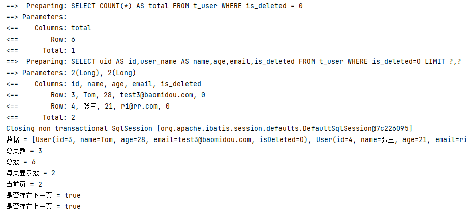


## 2、xml 自定义分页

### a> UserMapper 中定义接口方法

```java
    /**
     * 通过年龄查询用户信息并分页
     *  如果想要使用 MyBatis-Plus 自带的 Page 分页功能则必须位于第一个参数位置
     * @param page  MyBatis-Plus 所提供的分页对象，必须位于第一个参数位置
     * @param age
     * @return
     */
    Page<User> selectPageVo(@Param("page") Page<User> page,@Param("age") Integer age);
```


### b> UserMapper.xml 中编写 SQL

```xml
    <!--  Page<User> selectPageVo(@Param("page") Page<User> page,@Param("age") Integer age);  -->
    <select id="selectPageVo" resultType="User">
        select uid, user_name, age, email
        from t_user
        where age > #{age}
    </select>
```


<font style="font-size:20px">**注意：**</font>

- 在 XML 文件中编写 SQL 的时候，一定不要在末尾处多加一个分号 **`;`** 


### c> 测试

```java
    @Test
    public void test_PageVo(){
        Page<User> page = new Page<>(1, 2);
        userMapper.selectPageVo(page, 20);
        System.out.println("数据 = " + page.getRecords());
        System.out.println("总页数 = " + page.getPages());
        System.out.println("总数 = " + page.getTotal());
        System.out.println("每页显示数 = " +  + page.getSize());
        System.out.println("当前页 = " + page.getCurrent());
        System.out.println("是否存在下一页 = " + page.hasNext());
        System.out.println("是否存在上一页 = " + page.hasPrevious());
    }
```


<font style="font-size:20px">**测试结果：**</font>

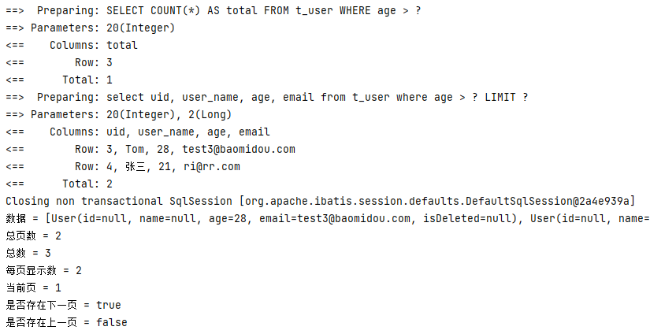


## 3、乐观锁

### a> 场景

>一件商品，成本价是80元，售价是100元。老板先是通知小李，说你去把商品价格增加50元。小 李正在玩游戏，耽搁了一个小时。正好一个小时后，老板觉得商品价格增加到150元，价格太 高，可能会影响销量。又通知小王，你把商品价格降低30元。 
>
>此时，小李和小王同时操作商品后台系统。小李操作的时候，系统先取出商品价格100元；小王 也在操作，取出的商品价格也是100元。小李将价格加了50元，并将100+50=150元存入了数据 库；小王将商品减了30元，并将100-30=70元存入了数据库。是的，如果没有锁，小李的操作就 完全被小王的覆盖了。 
>
>现在商品价格是70元，比成本价低10元。几分钟后，这个商品很快出售了1千多件商品，老板亏1 万多。


### b> 乐观锁与悲观锁

>上面的故事，如果是乐观锁，小王保存价格前，会检查下价格是否被人修改过了。如果被修改过 了，则重新取出的被修改后的价格，150元，这样他会将120元存入数据库。
>
>如果是悲观锁，小李取出数据后，小王只能等小李操作完之后，才能对价格进行操作，也会保证 最终的价格是120元。


### c> 模拟修改冲突

<font style="font-size:20px">**数据库中添加商品表**</font>

```sql
CREATE TABLE t_product
(
    id BIGINT(20) NOT NULL COMMENT '主键ID',
    NAME VARCHAR(30) NULL DEFAULT NULL COMMENT '商品名称',
    price INT(11) DEFAULT 0 COMMENT '价格',
    VERSION INT(11) DEFAULT 0 COMMENT '乐观锁版本号',
    PRIMARY KEY (id)
);
```


<font style="font-size:20px">**添加数据**</font>

```sql
INSERT INTO t_product (id, NAME, price) 
VALUES (1, '外星人笔记本', 100);
```


<font style="font-size:20px">**添加实体**</font>

```java
import lombok.Data;
@Data
public class Product {
    private Long id;
    private String name;
    private Integer price;
    private Integer version;
}
```


<font style="font-size:20px">**添加 mapper 并继承 BaseMapper 类**</font>

```java
@Mapper
public interface ProductMapper extends BaseMapper<Product> {
}
```


<font style="font-size:20px">**测试**</font>

```java
    @Test
    public void test_ProductDemo(){
        // 小李查询的商品价格
        Product productLi = productMapper.selectById(1);
        System.out.println("小李查询的商品价格：" + productLi.getPrice());

        // 小王查询的商品价格
        Product productWang = productMapper.selectById(1);
        System.out.println("小王查询的商品价格：" + productWang.getPrice());

        // 小李将商品价格 +50
        productLi.setPrice(productLi.getPrice() + 50);
        productMapper.updateById(productLi);

        // 小王将商品价格 -30
        productWang.setPrice(productWang.getPrice() - 30);
        productMapper.updateById(productWang);

        // 老板查询商品价格
        Product productLaoBan = productMapper.selectById(1);
        System.out.println("老板查询的商品价格：" + productLaoBan.getPrice());

    }
```


### d>  乐观锁实现流程

1. 数据库中添加 version 字段代表版本号

2. 取出记录时，获取当前 version

   ```sql
   select id, name, price, version
   from product
   where id = 1
   ```

3. 更新时，version + 1，如果 where 语句中的 version 版本不对，则更新失败

   ```sql
   update product
   set price = price + 50, version = version + 1
   where id = 1 and version = 1
   ```

   

### e> MyBatis-Plus 实现乐观锁

#### 修改实体类

```java
import com.baomidou.mybatisplus.annotation.Version;
import lombok.Data;
@Data
public class Product {
    private Long id;
    private String name;
    private Integer price;
    @Version // 标识乐观锁版本号字段
    private Integer version;
}
```


#### 添加乐观锁插件配置

```java
@Configuration
// 扫描指定包下的 mapper 接口
@MapperScan("com.Ri.mybatis_plus.mapper")
public class MyBatisPlusConfig {
    @Bean
    // 配置 MybatisPlus 中的插件
    public MybatisPlusInterceptor mybatisPlusInterceptor(){
        MybatisPlusInterceptor interceptor = new MybatisPlusInterceptor();
        // 添加内部插件, 并使用 DbType枚举类型 来设置数据库类型
        interceptor.addInnerInterceptor(new PaginationInnerInterceptor(DbType.MYSQL));
        // 添加乐观锁配置
        interceptor.addInnerInterceptor(new OptimisticLockerInnerInterceptor());
        // 返回即可
        return interceptor;
    }
}
```


#### 测试修改冲突

>小李查询商品信息： 
>
>​	SELECT id,name,price,version FROM t_product WHERE id=? 
>
>小王查询商品信息： 
>
>​	SELECT id,name,price,version FROM t_product WHERE id=? 
>
>小李修改商品价格，自动将version+1 
>
>​	UPDATE t_product SET name=?, price=?, version=? WHERE id=? AND version=? Parameters: 外星人笔记本(String), 150(Integer), 1(Integer), 1(Long), 0(Integer) 
>
>小王修改商品价格，此时version已更新，条件不成立，修改失败 
>
>​	UPDATE t_product SET name=?, price=?, version=? WHERE id=? AND version=? Parameters: 外星人笔记本(String), 70(Integer), 1(Integer), 1(Long), 0(Integer) 
>
>最终，小王修改失败，查询价格：150 
>
>​	SELECT id,name,price,version FROM t_product WHERE id=?


#### 优化流程

```java
        @Test
        public void test_ProductDemo(){
            // 小李查询的商品价格
            Product productLi = productMapper.selectById(1L);
            System.out.println("小李查询的商品价格：" + productLi.getPrice());

            // 小王查询的商品价格
            Product productWang = productMapper.selectById(1L);
            System.out.println("小王查询的商品价格：" + productWang.getPrice());

            // 小李将商品价格 +50
            productLi.setPrice(productLi.getPrice() + 50);
            productMapper.updateById(productLi);

            // 小王将商品价格 -30
            productWang.setPrice(productWang.getPrice() - 30);
            int result = productMapper.updateById(productWang);

                // 如果 result == 0 的话代表执行失败, 重新查询执行即可
            if(result == 0){
                productWang = productMapper.selectById(1L);
                productWang.setPrice(productWang.getPrice() - 30);
                productMapper.updateById(productWang);
            }

            // 老板查询商品价格
            Product productLaoBan = productMapper.selectById(1);
            System.out.println("老板查询的商品价格：" + productLaoBan.getPrice());

        }
```


# 七、通用枚举

>表中的有些字段值是固定的，例如性别（男或女），此时我们可以使用  MyBatis-Plus 的通用枚举来实现


## a> 数据库表添加字段 sex

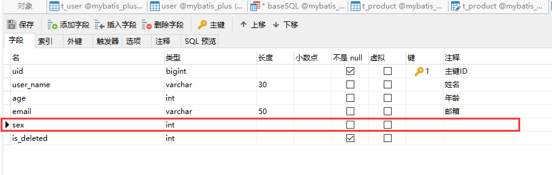


## b> 创建通用枚举类型

```java
@Getter // 枚举类型都是常量, 只给 get 方法即可
public enum SexEnum {
    MALE(1, "男"),
    FEMALE(2, "女");

    @EnumValue
    // 代表枚举类型, 插入的时候会直接将这个值作为参数传入, 不用扫描 type-enums-package 包即可使用
    // 官网并没有提示 type-enums-package 是什么时候过时的, 请注意甄别
    private Integer sex;
    private String sexName;

    SexEnum(Integer sex, String sexName){
        this.sex = sex;
        this.sexName = sexName;
    }
}
```


## c> 配置扫描通过枚举

```yaml
mybatis-plus:
  configuration:
    # 使用 mybatis-plus 的日志功能, 来查看 mybatis-plus 自动生成的 sql
    log-impl: org.apache.ibatis.logging.stdout.StdOutImpl

  # mybatis-plus 的默认路径是类路径下mapper下的所有xml文件, 如果不写也是一样的
  mapper-locations: "classpath*:/mapper/**/*.xml"

  # 设置 mybatis plus 的全局配置
  global-config:
    db-config:
      # 设置 实体类 对流的表的统一前缀
      table-prefix: t_
      # 设置统一的主键生成策略
 	  id-type: auto
  # 配置类型别名所对应的包
  type-aliases-package: com.Ri.mybatis_plus.pojo
  type-enums-package: com.Ri.mybatis_plus.enums
```


<font style="font-size:20px">**注意：**</font>

- 官网并没有提示 `type-enums-package` 是什么时候过时的, 请注意甄别
- 如有报错请注意配置这个 `type-enums-package` ，否则会出现问题


## d> 测试

```java
    @Test
    public void test_enumDemo(){
        /*
        *   INSERT INTO t_user ( uid, user_name, sex )
        *   VALUES ( ?, ?, ? )
        *   Parameters: 7(Long), admin(String), 1(Integer)
         */
        User user = new User();
        user.setId(7L);
        user.setName("admin");
        user.setSex(SexEnum.MALE);
        userMapper.insert(user);
    }
```


# 八、代码生成器

## 1、引入依赖

```xml
        <!--    引入和 mybatis-plus 相同版本的 generator 依赖    -->
        <dependency>
            <groupId>com.baomidou</groupId>
            <artifactId>mybatis-plus-generator</artifactId>
            <version>3.5.3.1</version>
        </dependency>

        <!--    在生成时使用到了 freemarker 引擎模板, 所以也要加入依赖    -->
        <dependency>
            <groupId>org.freemarker</groupId>
            <artifactId>freemarker</artifactId>
            <version>2.3.31</version>
        </dependency>
```


## 2、快速生成

```java
public class FastAutoGeneratorTest {
    public static void main(String[] args) {
        FastAutoGenerator.create("jdbc:mysql://localhost:3306/mybatis_plus", "root", "zh0604")
                .globalConfig(builder -> {
                    builder.author("Ri") // 设置作者
                            .enableSwagger() // 开启 swagger 模式
                            .outputDir("D://mybatisplus"); // 指定输出目录
                })
                .dataSourceConfig(builder ->
                        builder.typeConvertHandler((globalConfig, typeRegistry, metaInfo) -> {
                            int typeCode = metaInfo.getJdbcType().TYPE_CODE;
                            if (typeCode == Types.SMALLINT) {
                                // 自定义类型转换
                                return DbColumnType.INTEGER;
                            }
                            return typeRegistry.getColumnType(metaInfo);
                        })
                )
                .packageConfig(builder ->
                        builder.parent("com.Ri.mybatisplus") // 设置父包名
                                .moduleName("system") // 设置父包模块名
                                .pathInfo(Collections.singletonMap(OutputFile.xml, "D://mybatisplus")) // 设置mapperXml生成路径
                )
                .strategyConfig(builder ->
                        builder.addInclude("t_user") // 设置需要生成的表名
                                .addTablePrefix("t_", "c_") // 设置过滤表前缀
                )
                .templateEngine(new FreemarkerTemplateEngine()) // 使用Freemarker引擎模板，默认的是Velocity引擎模板
                .execute();
    }
}
```


# 九、多数据源

>适用于多种场景：纯粹多库、读写分离、一主多从、混合模式等
>
>目前我们就来模拟一个纯粹多库的一个场景，其它场景类似
>
>场景说明：
>
>​	我们创建两个库，分别为：mybatis_plus（原库不动）与 mybatis_plus_1（新建），将 mybatis_plus 库的 product 表移动到 mybatis_plus_1 库，这样每个库一张表，通过一个测试用例分别获取用户数据与商品数据，如果获取到说明多库模拟成功


## 1、创建数据库及表

>创建数据库 mybatis_plus_1 和表 product

```sql
CREATE DATABASE `mybatis_plus_1`;
use `mybatis_plus_1`;
CREATE TABLE product
(
	id BIGINT(20) NOT NULL COMMENT '主键ID',
	name VARCHAR(30) NULL DEFAULT NULL COMMENT '商品名称',
	price INT(11) DEFAULT 0 COMMENT '价格',
	version INT(11) DEFAULT 0 COMMENT '乐观锁版本号',
	PRIMARY KEY (id)
);
```


>添加测试数据

```sql
INSERT INTO product (id, NAME, price) VALUES (1, '外星人笔记本', 100);
```


>删除 mybatis_plus 库 product 表

```sql
use mybatis_plus;
DROP TABLE IF EXISTS product;
```


## 2、引入依赖

```xml
        <!--    多数据源依赖    -->
        <dependency>
            <groupId>com.baomidou</groupId>
            <artifactId>dynamic-datasource-spring-boot-starter</artifactId>
            <version>3.6.1</version>
        </dependency>
```


## 3、配置多数据源

>说明：注释掉之前的数据库连接，添加新配置

```yaml
spring:
  datasource:
    dynamic:
      # 设置默认数据源
      primary: mybatis_1
      # 严格模式, 没有设置数据源默认为 primary 的数据源, 没有匹配上则直接报错
      strict: false
      # 配置多个数据源
      datasource:
        # 数据源名称
        mybatis_1:
          url: jdbc:mysql://localhost:3306/mybatis_plus
          driver-class-name: com.mysql.cj.jdbc.Driver
          username: root
          password: zh0604
        mybatis_2:
          url: jdbc:mysql://localhost:3306/mybatis_plus_1
          driver-class-name: com.mysql.cj.jdbc.Driver
          username: root
          password: zh0604

mybatis-plus:
  configuration:
    # 配置 SQL 输出
    log-impl: org.apache.ibatis.logging.stdout.StdOutImpl
```


## 4、创建用户 Service

```java
// 父接口继承 IService
public interface UserService extends IService<User> {
}
```

```java
@Service
// 子接口实现父接口, 然后再继承 mybatis-plus 中的 ServiceImpl 接口来对父类的接口进行实现
// 设置数据源, 使用 配置文件中已有的数据源名称
@DS("mybatis_1")
public class UserServiceImpl extends ServiceImpl<UserMapper, User> implements UserService {
}
```


## 5、创建商品 Service

```java
public interface ProductService extends IService<Product> {
}
```

```java
@Service
@DS("mybatis_2")
public class ProductServiceImpl extends ServiceImpl<ProductMapper, Product> implements ProductService{
}
```


## 6、测试

```java
    @Autowired
    private UserService userService;

    @Autowired
    private ProductService productService;

    @Test
    public void test_DSDemo(){
        // 需求，查询库1 中的 User，和 库2 中的 Product
        // 在 UserServiceImpl 中使用了 @DS 注解，设置了查询的数据源, 所以它查询的是表一
        /*
        *   SELECT uid,user_name,age,email,sex,is_deleted
        *   FROM t_user
        *   WHERE uid=?
         */
        System.out.println(userService.getById(1L));

        // 在 ProductServiceImpl 中使用了 @DS 注解，设置了查询的数据源, 所以它查询的是表二
        /*
        *   SELECT id,name,price,version
        *   FROM product
        *   WHERE id=?
         */
        System.out.println(productService.getById(1L));
    }
```

<font style="font-size:20px">**测试结果**</font>

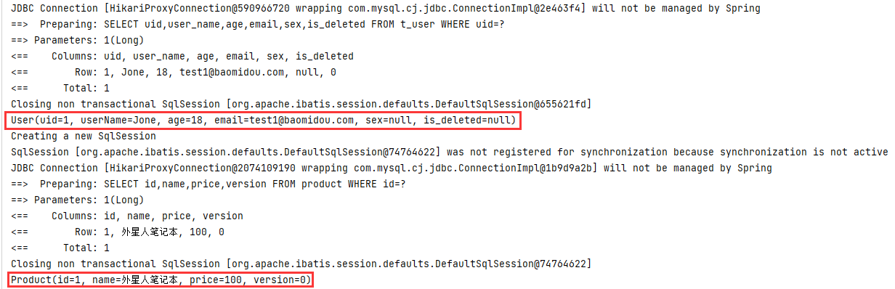


>结果：
>
>1. 都能顺利获取对象，则测试成功
>2. 如果我们实现读写分离，将写操作方法加上主库数据源，读操作方法加上从库数据源，自动切换，是不是就能实现读写分离了
>
>


# 十、MyBatisX 插件

>MyBatis-Plus为我们提供了强大的mapper和service模板，能够大大的提高开发效率 
>
>但是在真正开发过程中，MyBatis-Plus并不能为我们解决所有问题，例如一些复杂的SQL，多表 联查，我们就需要自己去编写代码和SQL语句，我们该如何快速的解决这个问题呢，这个时候可 以使用MyBatisX插件 
>
>MyBatisX一款基于 IDEA 的快速开发插件，为效率而生。


MyBatisX插件用法：[Mybatis X 插件 | MyBatis-Plus (baomidou.com)](https://baomidou.com/guides/mybatis-x/)


# 源码下载失败处理方案

在对应项目pom.xml所在目录下执行以下命令：

```shell
mvn dependency:resolve -Dclassifier=sources
```

执行完毕后即可下载源码